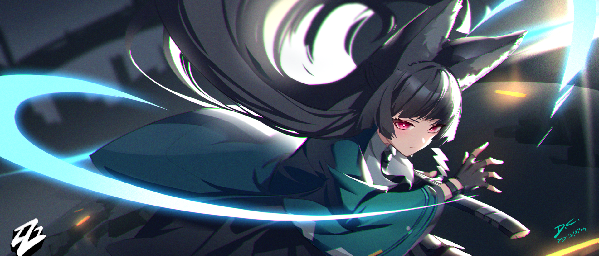

  

    
『 <strong>黒崎零について</strong> 』

    
<strong>ガチャ大好きオタク。</strong>

    
<strong>ガチャゲー、リズムゲー、FPSが好きです！</strong>

    
<strong>vtuber見るのも好き。</strong>

    
<strong>暇さえあればコーディングしてます。</strong>

    
<strong>普段は邦楽を聴いてます。</strong>

    
<strong>を聴くのが好きです。</strong>

  

  

    
  

<h3 align="left">Connect with me:</h3>

  
  

<h3 align="left">Languages and Tools:</h3>

  
  

<picture>
  <source media="(prefers-color-scheme: dark)" srcset="snake.svg" />
  
</picture>
